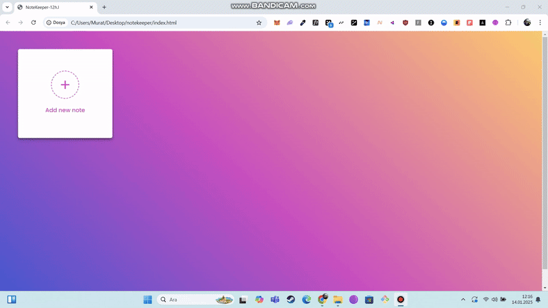

NotKeeper Uygulaması 

Bu proje, HTML, CSS ve JavaScript kullanılarak geliştirilmiş bir NotKeeper uygulamasıdır. Uygulama, kullanıcıların not eklemesine, güncellemesine ve silmesine olanak tanır. Ayrıca, not silinmeden önce kullanıcıyı uyaran bir uyarı sistemi de mevcuttur. Uygulama, tamamen duyarlı bir tasarıma sahip olup, farklı ekran boyutlarında (mobil, tablet, masaüstü) sorunsuz bir şekilde çalışmaktadır. 

Özellikler: 
Not Ekleme: Kullanıcılar, istedikleri kadar not ekleyebilir. 
Not Güncelleme: Eklenen notlar, kullanıcı tarafından düzenlenebilir. 
Not Silme: Kullanıcılar notlarını silebilir. 
Silme işlemi öncesinde, kullanıcıya bir uyarı mesajı gösterilir. 
Duyarlı Tasarım: Uygulama, tüm cihazlarda (mobil, tablet, masaüstü) uyumlu şekilde çalışır. 

 

